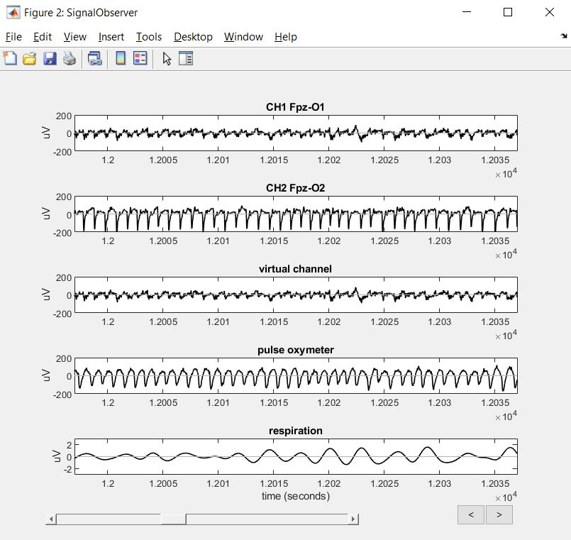

# sleep-tracker
## Welcome to the sleep-tracker project !

This project has been conducted during ESPCI practical sessions under the supervision of Prof. Thierry Gallopin. 
The document Sotty_Dagommer_Physiology_Dreem.pdf contains a thorough description of the study in French.

## Context
The project consisted in analyzing the data recorded by the Dreem headband on several subjects (including ESPCI students) and quantify
the density of delta waves during sleep for each of them. https://dreem.com/

Delta waves are electrical signals that occur during sleep and can be recorded by electroencephalogram. They are currently associated with restful sleep. 

The dreem headband monitors several physiological signals (respiration, heart rate, electrical signals due to neuronal activity) 
thanks to numerous sensors (accelerometer, oxymeter, electro-encephalogramm).

## Run

## Output

